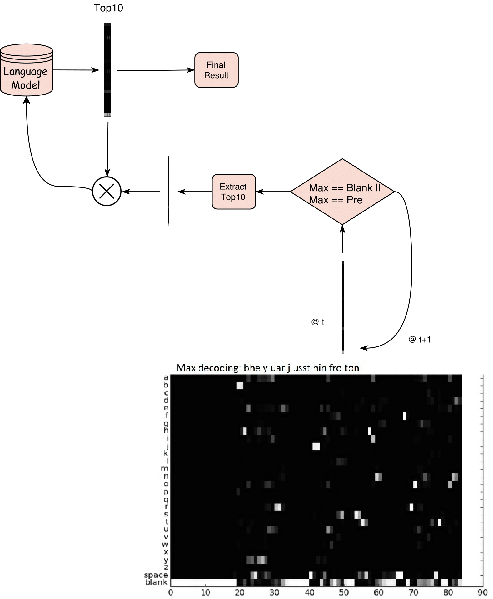
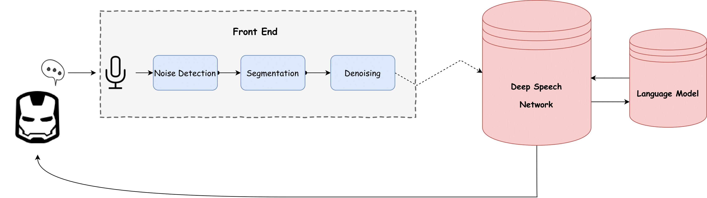
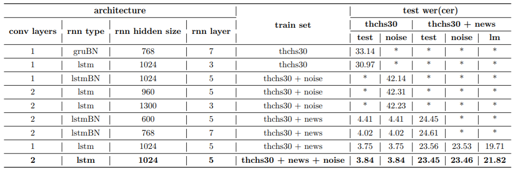
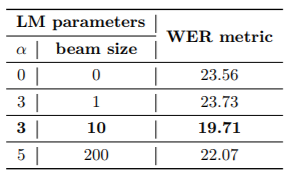

Chinese Speech Recognition
==========================

(Latest update: 2017/06/30)

This is the Chinese-only speech recognition project based on [deepspeech.torch](https://github.com/SeanNaren/deepspeech.torch), and it supports N-gram language model embedding.

Introduction
============

In this project, we attempted with Deep Speech 2 on efficient speech recognition task. Deep Speech 2 [@deepspeech2] is an End-to-end Deep learning based speech recognition system proposed by Baidu Research. It is round 7x faster than Deep Speech 1, up to 43% more accurate. Possible to deploy the system in online setting. This feature makes it possible for us to implement a real-time demo for online speech recognition. We ported the public github version to Mandarin by feeding the network with news dataset and THCS30 dataset. Our experiment results show that this system has outperformed Kaidi tutorials with a lower WER score and faster deployment speed. To further improve the prediction accuracy of our system, we equipped our model with a self-designed N-Gram language model and further boosted the WER scores. Our demo is implemented on a distributed level. Front end is implemented based on Web Applications, is able to run at any browsers. Deployment of network is on servers with GPUs. The forward of Deep Speech Network will be largely accelerated.

Detailed Approach
=================

Deep Speech 2 Structure Description
-----------------------------------

We build our models by training a deep neural network comprised of convolutional (Conv) layers, bi-directional recurrent (BiRNN) layers and fully connected (FC) layers.

This network takes spectral feature vectors as input. The spectral inputs are fed into a Conv layer. In general, one could consider architectures with multiple Conv layers employing either 1D or 2D convolutions. There could also be a cascade of several Conv layers. We found that one Conv layer is strong enough for our relatively small dataset, so we’ll employ only one Conv layer in the final version.

The outputs from the Conv layer(s) will be fed into a stack of BiRNN layers. Each BiRNN layer is comprised of a pair of RNNs running in tandem, with the input sequence presented in opposite directions.

The outputs from the pair of RNNs are then concatenated. BiRNN layers are particularly suited to processing speech signals as they allow the network access to both future and past contexts at every given point of the input sequence. Though @deepspeech2 stated that applying batch normalization to RNNs will produce better prediction results, our RNNs does not work well with batch normalization so that we discarded it in the final version. We set the output dimension of each RNN layer as 1024, because we find this feature dimension is large enough to encode the information it needs to forward.

The outputs from the BiRNN layers at each timestep are then fed into a fully connected layer. Each unit corresponds to a single character in the alphabet characterizing the target vocabulary. For example, since our data is comprised of Chinese corpora, the alphabet we use include 3645 characters in common use, as well as a blank symbol and an unknown token. The blank character allows the CTC model to reliably deal with predicting consecutive repeated symbols, as well as artifacts in speech signals, e.g. pauses, background noise and other “non-speech” events.

Thus, given a sequence of frames corresponding to an utterance, the model is required to produce, for each frame, a probability distribution over the alphabet.

Training Strategy
-----------------

During the training phase, the softmax outputs are fed into a CTC cost function (more on this shortly) which uses the actual transcripts to (i) score the model’s predictions, and (ii) generate an error signal quantifying the accuracy of the model’s predictions. The overall goal is to train the model to increase the overall score of its predictions relative to the actual transcripts.

We use “Xavier” initialization for all layers in our models. To update our model, nesterov momentum method is applied along with annealed learning rate. Most of the model’s hyperparameters, e.g. the depth of the network, the number of units in a given layer, the learning rate, the annealing rate, the momentum, etc., are chosen empirically based on our test on validation dataset. We train the model with a batch size of 10 on 2 NVIDIA TITAN X.

Add Language Model
------------------

With large networks like the ones used by Baidu Research and given enough training data, the network learns an implicit language model. However, since the labeled training data is still small, the use of explicit Language Model still improves WER by a large margin

$$Q(y)=\log(p_{ctc}(y|x)) + \alpha \log(p_lm(y)) + \beta word\_count(y)$$

The Goal is to find y that maximized $Q(y)$. Here $\alpha$ and $\beta$ are tunable parameters found using development set. The optimal y is found using Beam Search. A complete search to the whole possible spacegives the best result but is computational expensive, we combined with some greedy tricks to ensure its real-time performance.

We decided to utilize beam search to combine our language model and CTC predictions. Considering the time efficiency we can endure, we’ve designed a pipeline that is able to equip our real-time requirements. One thing to add is that, since we follow the setting of CTC loss, the algorithm will skip on time $t$ when the top prediction is blank or same as the previous one.

We’ve tried 3 strategies based on different size $s$ of beam. We’ll list them as follows

1.  if $s==1$:

    Each time $t$ we apply Cartesian Product of current 6000 predictions with previous calculated sentences and feed them into language model to get scores estimated by language model. We pick the prediction using weighted scores as shown in equation \[eqa:loss\].

2.  if $1<s<200$:

    For each time $t$, we select $s$ top ranked prediction, apply Cartesian Product with previous results, and send them into language model to give predictions. We resort the weighted results given by language model and CTC, and pick the top $s$. In this pipeline, no matter how long the sequence is, the max num of items being calculated by our language model is no longer than $s^2$. This makes the computational cost tolerable.

3.  if $s > 200$:

    Every moment $t$ we apply Cartesian Product with previous results. Top $s$ sentences will be selected only by estimated CTC probabilities. We will only feed surviving $s$ sentences into language model when the whole clip has been handled. We select the best sentence by weighted estimation of CTC and language model.

Deployment Strategy
-------------------

Our demo framework is separated into Front End and Backend. Backend is deployed at servers with GPUs. The forward of Deep Speech Network will be largely accelerated. We load the model into GPU once, and server will listen on port to requests to conduct forwarding computation. Language model will also be ready at servers to calculate scores of top queries given by DNN. Front end is implemented based on Web Applications, which is able to run at any browsers. It is responsible to conduct necessary preprocessing which will be explained later.

### Front End

#### Noise Detection

There are particular features for human’s pronunciation (e.g. Voiced and Unvoiced) compared with noise. We detect such cases using handcrafted energy based methods.

#### Snippet Cutting

Here we calculate energy for each frame. Continuous low-energy frames are considered to be silence scene thus we discard them using fixed threshold. Besides, it also requires a minimum time lapse between two sentences.

#### Denoising

The procedure goes as follows,

-   When we start the front end, this program will automatically record the environment noise and calculated its spectrum for future reference.

-   We first apply FFT to snippet of previously detected noise and regard it as background noise.

-   Subtract background noise spectrum from audio spectrum.

-   Then, we apply IFFT to audio spectrum and get audio snippet with background suppression.

### Communication Between Front End and Back End

After recording, we apply methods described in Frontend section and ended up with a locally saved audio file. We upload this file to remote server using secure copy and its filename through TCP socket. Once the remote server has received this file and its filename, it will automatically start forwarding and generate prediction sentence. Once it has finished computing, results will be sent back to front end by TCP socket. Front end will then display the result on the screen.

Experiments
-----------

When training Deep Speech 2 model, we employ both news dataset provided along with thchs30 dataset. We split the news dataset using given annotations. Notice that we drop a snippet if it is too long or too short. We conducted several experiments to examine a reasonable parameter setting.

Above is the table for ablation study. Though @deepspeech2 claims that a deeper model with less hidden size will work well, our result demonstrates an opposition. This is probably due to the fact that our training data is much more smaller than the one used by Baidu. We employ the last line shown in the table as our final setting.

### Language Model Selection

We also sampled several parameter settings to test on language model selection.

From the above table we see that language model is able to lower down the WER metric score based on DNN models. Parameter setting of the second line is applied in our final submitted demo.
